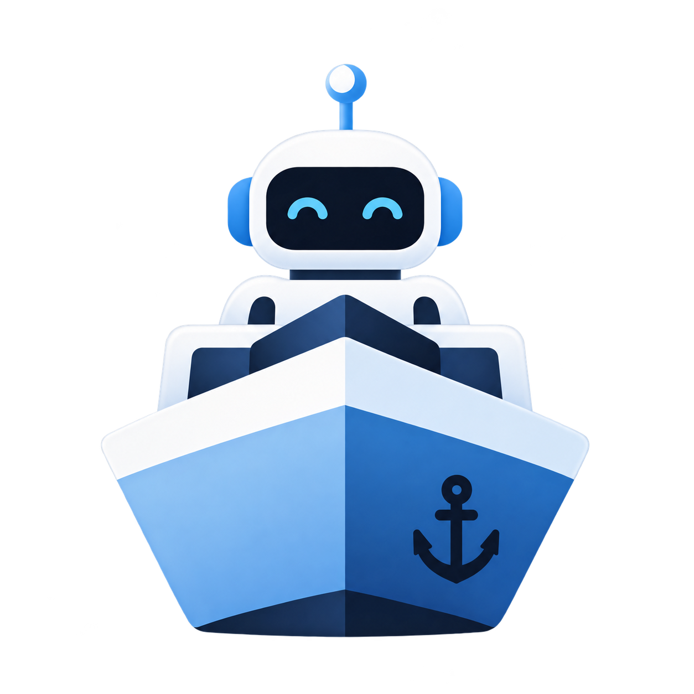

# Shipyard

<p align="center">
  
</p>

> **Source-available toolkit for running AI coding agents in isolated sandboxes.**

[](https://github.com/snappedly/shipyard/actions/workflows/ci.yml)

Shipyard runs AI coding agents in isolated sandboxes. Choose an agent, a
sandbox provider, and a prompt; Shipyard manages the sandbox lifecycle,
branches, logs, sessions, and commits.

## Why Shipyard

- **Isolated by default.** Keep agent work inside Docker locally or Vercel
  Sandbox remotely.
- **Purpose-built agents.** Use Codex or Claude Code without carrying support
  for unrelated coding-agent CLIs.
- **Reviewable changes.** Control how branches and worktrees move changes back
  to the host repository.

## Quick start

You need Node.js 20.18.1 or newer, Git, Docker, and credentials for your chosen
coding agent.
Run these commands inside the Git repository the agent should change:

```sh
npm install --save-dev @snappedly-tools/shipyard
npx shipyard init
cp .shipyard/.env.example .shipyard/.env
```

`init` asks which agent, sandbox provider, and starter template to use. Its
issue-based templates use GitHub Issues. Init always attempts to create or
update the lowercase `shipyard` label, and built-in issue workflows select only
open issues carrying that label. When you select Codex, init also asks whether
to sign in with ChatGPT or use an API key. Start with the `blank` template. Put
any requested credentials in `.shipyard/.env`, then write one concrete task in
`.shipyard/prompt.md`.

Use a subscription first when the selected agent supports it. If subscription
authentication does not work in your environment, use the API-key fallback:

- Codex subscription authentication: choose **Sign in with ChatGPT** during
  interactive init and complete the browser login. The generated configuration
  mounts `~/.codex/auth.json` read-only. For non-interactive init, run
  `codex login` on the host, then pass `--codex-auth chatgpt`.
- Codex API authentication: choose **OpenAI API key** during interactive init
  and put `OPENAI_API_KEY` in `.shipyard/.env`. For non-interactive init, pass
  `--codex-auth api-key`.
- Claude Code subscription authentication: run `claude setup-token` on the
  host and put the result in `CLAUDE_CODE_OAUTH_TOKEN` in `.shipyard/.env`.
- Claude Code API authentication: uncomment `ANTHROPIC_API_KEY` in
  `.shipyard/.env` and put your API key there.
- GitHub Issues authentication: set `GH_TOKEN` and `GH_REPO` in `.shipyard/.env`.

Run it:

```sh
npx shipyard run
```

`shipyard run` builds the generated Docker image, executes the
generated TypeScript entry point, and cleans up the sandbox. Reuse the cached
image when its definition has not changed:

```sh
npx shipyard run --skip-build
```

Shipyard supports Codex and Claude Code agents, with Docker, Vercel Sandbox,
and no-sandbox providers. `shipyard init` scaffolds Docker; configure Vercel
Sandbox or no-sandbox mode through the JavaScript interface.

## Repository runner for GitHub Issues

Shipyard can keep one repository ready for labelled GitHub Issues on a
user-managed Mac. This deployment currently supports GitHub.com repositories
on Apple Silicon macOS only. It uses GitHub's official self-hosted Actions
runner as a wake-up transport; the foreground Shipyard controller owns the
actual work outside the Actions job.

Prerequisites are an initialized repository, Docker Desktop, `gh` authenticated
to GitHub.com with repository-administration access, and the credentials needed
by the selected agent in `.shipyard/.env`. Install from the repository root:

```sh
npx shipyard runner install
git add .github/workflows/shipyard-wake.yml .shipyard/.gitignore
git commit -m "Add Shipyard wake workflow"
git push
npx shipyard runner start
```

Interactive `shipyard init` also offers installation after it creates a valid
scaffold, defaulting to No. Non-interactive init skips installation unless
`--install-runner true` is passed. Installation creates the workflow locally;
it never commits or pushes it. `runner start` requires the exact generated
workflow on the repository's default branch.

The activation label is the exact, lowercase label `shipyard`. Init attempts to
create it, and start creates it if it is missing. Adding that label or manually
dispatching the **Shipyard wake-up** workflow wakes the controller. Labels with
different casing do not match. Issue edits and comments do not wake it.

The controller first checks the current backlog, so restarting it recovers work
labelled while the Mac was off. It invokes exactly `npx shipyard run`, then
compares the eligible issue-number set. An empty set returns it to idle; a
changed nonempty set starts another finite invocation; an unchanged set records
no progress and returns it to idle instead of looping. A later label event,
manual dispatch, or restart retries that backlog. Wake-ups delivered while
Shipyard is busy are coalesced.

The Actions job only reports whether its wake-up reached the controller. It
does not report the later agent outcome and does not own the agent's runtime.
The controller stays available only while `runner start` remains open in its
foreground terminal. Ctrl-C, closing that terminal, or `runner stop` stops it
and cancels active work; it does not start at login. A nonzero Shipyard exit or
infrastructure failure records the error and takes the controller offline.

Use these commands from the same repository root:

```sh
npx shipyard runner status
npx shipyard runner stop
npx shipyard runner remove
```

Status reports local process state, GitHub connectivity, repository identity,
and the last outcome without showing credentials. Runner binaries, credentials,
state, and diagnostics are protected and ignored under `.shipyard/runner/`;
normal removal unregisters the runner and deletes those files while preserving
the Shipyard config, workflow, issues, logs, and worktrees. If GitHub
unregistration is unavailable, retry after restoring access. As a last resort,
`runner remove --force` deletes local files and prints the GitHub registration
that must be removed manually.

There is no Mac sleep/wake detector. GitHub can discard a queued self-hosted job
after 24 hours, so after a long sleep use manual workflow dispatch or restart
the controller. GitHub removes self-hosted runner registrations after 14 days
offline; the next start automatically re-registers with the current
administrative `gh` login. A Mac rename does not rename an existing
registration—remove and reinstall it explicitly.

GitHub does not charge Actions minutes for self-hosted runner execution. Model
costs apply only when a preflight finds eligible issues and starts Shipyard;
the host owner still pays for hardware, electricity, network, Docker, and model
usage. GitHub warns that self-hosted runners on public repositories can be
exposed to untrusted repository activity. Use this deployment only where label
authority, workflows, collaborators, and agent credentials have an acceptable
trust boundary. See GitHub's
[self-hosted runner security guidance](https://docs.github.com/en/actions/reference/security/secure-use#hardening-for-self-hosted-runners).

For setup failures, run `runner status`, inspect the foreground terminal and
`.shipyard/runner/.shipyard-last-failure.json`, then verify Docker, GitHub
authentication with `gh auth status --hostname github.com`, `.shipyard/.env`,
the lowercase label, and the published workflow. The
[Apple Silicon validation runbook](docs/runbooks/repository-runner-macos-validation.md)
covers the complete lifecycle.

To run directly on the host without isolation:

```ts
import { CODEX_MODELS, codex, run } from "@snappedly-tools/shipyard";
import { noSandbox } from "@snappedly-tools/shipyard/sandboxes/no-sandbox";

const result = await run({
  agent: codex(CODEX_MODELS.routine),
  sandbox: noSandbox(),
  promptFile: ".shipyard/prompt.md",
});
```

No-sandbox mode grants the agent the permissions of the Shipyard process. Use
it only with trusted repositories and prompts.

## Generated files

| Path                              | Purpose                                                      |
| --------------------------------- | ------------------------------------------------------------ |
| `.shipyard/main.ts` or `main.mts` | Agent, sandbox, prompt, branch, hook, and iteration settings |
| `.shipyard/prompt.md`             | Task given to the agent                                      |
| `.shipyard/Dockerfile`            | Sandbox image definition                                     |
| `.shipyard/.env`                  | Untracked credentials passed into the sandbox                |
| `.shipyard/logs/`                 | Run logs                                                     |
| `.shipyard/worktrees/`            | Worktrees for separate-branch runs                           |
| `.shipyard/patches/`              | Recovery artifacts preserved after some failures             |
| `.shipyard/runner/`               | Protected self-hosted runner files and diagnostics           |

## Workflow templates

The bundled templates are:

- `blank`: one agent and your prompt;
- `simple-loop`: process issue-tracker tasks sequentially;
- `sequential-reviewer`: implement and review each task;
- `parallel-planner`: plan parallel work and merge its branches; and
- `parallel-planner-with-review`: add review to each parallel branch.

Read generated prompts before running an issue or merge workflow. Those
templates can close issues, create branches, and merge work.

The package also exports contracts for triage, implementation, review,
repair, handoff, and release recording. They are building blocks for hosted
automation, not a hosted service started by the quick-start commands.

## Security

Agents receive the permissions granted by their sandbox, mounts, credentials,
and hooks. Docker isolates repository and Git storage; it does not
mount the host checkout or Git metadata automatically. Explicit mounts must
stay outside the sandbox workspace and its ancestors.

Mounted credentials, devices, Docker sockets, groups, and network access can
still broaden an agent's access. Host hooks, no-sandbox mode, and custom
provider code retain their own trust requirements. Use
least-privilege credentials and review generated configuration before running
untrusted code.

See the [security evaluation](docs/security-evaluation.md) for findings,
fixes, and validation limits. Report vulnerabilities according to
[SECURITY.md](SECURITY.md).

## Contributing

See [CONTRIBUTING.md](CONTRIBUTING.md). The standard repository check is:

```sh
npm ci
npm run check
```

## License

Shipyard is source-available under the
[PolyForm Strict License 1.0.0](LICENSE). It is available for permitted
noncommercial use; the license does not permit redistribution, modification,
or derivative works. Contact Snappedly to request a commercial license.
