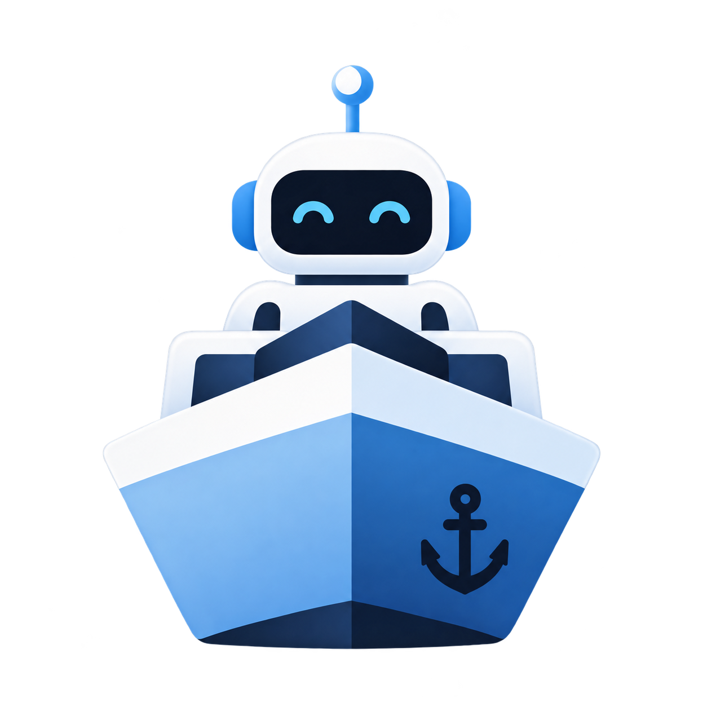

# Shipyard V1

<p align="center">
  
</p>

> **Fully autonomous coding workflows, protected by Docker.**

[](https://github.com/snappedly/shipyard-v1/actions/workflows/ci.yml)

Give Shipyard V1 a task or a GitHub issue. It runs Codex or Claude Code in an
isolated sandbox, can plan and review larger jobs, and brings the result back as
a commit or pull request you can inspect.

## The Shipyard V1 advantage

- **Isolated work.** Docker keeps the agent's files and Git work inside a
  sandbox while it runs.
- **Built for real projects.** Shipyard V1 can sort issue dependencies, work on
  independent tasks in parallel, and review the combined result.
- **You stay in control.** Runs have limits and logs. Issue workflows return a
  pull request for you to review and merge.

## Try it on one task

You need **Node.js 20.18.1+**, **Git**, **Docker running**, and **Codex or Claude Code**
with a subscription login or API key.

Run:

```sh
npx skills add snappedly/skills
```

Ask your coding agent to run `setup-snappedly-skills` in that repository.

```sh
npm install --save-dev @snappedly-tools/shipyard-v1
npx shipyard-v1 init
```

During `shipyard-v1 init`, choose your agent and template, then follow the
authentication prompts. GitHub Issues is the built-in tracker. Init builds the
Docker image and automatically installs the
[repository runner](docs/content/docs/repository-runner.mdx).

On a local Mac, the repository runner automatically wakes Shipyard V1 when you label an issue.
It runs as long as its terminal stays open.

See the [getting started guide](docs/content/docs/index.mdx) for authentication and
branch options.

Fill in any credentials required in `.shipyard-v1/.env`.
Set `GH_TOKEN` there before `runner start`; startup fails immediately if it is
missing or blank. Use a GH token with Contents, Issues, and Pull
Requests read/write access and Metadata read access.

Set `SHIPYARD_V1_ROUTINE_MODEL` and `SHIPYARD_V1_STRONG_MODEL` in `.shipyard-v1/.env`
for the roles your template uses. Both Codex and Claude Code workflows accept
`SHIPYARD_V1_ROUTINE_REASONING_EFFORT` and `SHIPYARD_V1_STRONG_REASONING_EFFORT`.

`simple-loop` uses routine for triage and
implementation. `sequential-reviewer` also uses strong for issue reviews.
Parallel planner templates use routine for ticket work and strong for planning,
conflict resolution, and integration. The review-enabled planner also uses
strong for ticket and final specification reviews. See
[agent setup](docs/content/docs/agents.mdx).

```sh
npx shipyard-v1 runner start
```

To start Shipyard V1 for a single run without the active runner, use:

```sh
npx shipyard-v1 run
```

To remove Shipyard V1 from the repository:

```sh
npx shipyard-v1 uninstall
```

To upgrade an existing installation:

1. Run `npx shipyard runner stop` and `npx shipyard runner remove` while the old
   package and `.shipyard/` directory are still present.
2. Replace `@snappedly-tools/shipyard` with `@snappedly-tools/shipyard-v1` in
   your dependencies. Run `npx shipyard-v1 init` to generate the new config
   directory, issue labels, and runner workflow.
3. Port custom prompts and entrypoint settings. Rename `SHIPYARD_*` environment
   variables to `SHIPYARD_V1_*`. Remove the old `shipyard-wake.yml` workflow
   after the V1 runner works.

Keep `.shipyard/` as a backup until the V1 setup works. Do not move its runner,
worktrees, or locks into `.shipyard-v1/`.

## Turn GitHub issues into pull requests

Then:

1. Write an issue with a clear goal. If it is already triaged and approved for
   agent implementation, add `ready-for-agent`. Add `shipyard-v1` last to activate
   the issue.
2. Run Shipyard V1. It triages issues without `ready-for-agent`, verifies ready
   issues, implements them in Docker, reviews the work, and opens a pull request.
3. Inspect the pull request and merge it when you are happy with the result.

## Choose a workflow

| Template                       | What it does                                       |
| ------------------------------ | -------------------------------------------------- |
| `simple-loop`                  | Works through labeled issues one at a time.        |
| `sequential-reviewer`          | Implements and reviews issues before PR handoff.   |
| `parallel-planner`             | Plans and works on independent issues in parallel. |
| `parallel-planner-with-review` | Adds review to the parallel workflow.              |

The package root exports the core run, interactive, and sandbox APIs. Import
hosted workflow coordination and GitHub integration APIs from
`@snappedly-tools/shipyard-v1/workflow` and
`@snappedly-tools/shipyard-v1/integrations/github`. Configure prompts, branches,
limits, and hooks in the generated `.shipyard-v1/main.ts` or `.shipyard-v1/main.mts`.
See [configuration](docs/content/docs/configuration.mdx) and
[agent setup](docs/content/docs/agents.mdx).

## Safety and license

Shipyard V1 runs on your machine or infrastructure. Sandbox access depends on the
mounts, credentials, and network settings you choose. Read the
[security guide](docs/security-evaluation.md) before using untrusted code.

Shipyard V1 is source-available under the [PolyForm Strict License 1.0.0](LICENSE)
for permitted noncommercial use. Contact Snappedly for a commercial license.
