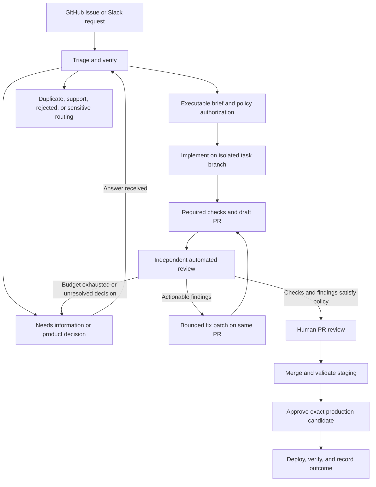

# Snappedly Shipyard: development automation proposal

Status: independent source ownership approved; workflow design remains a proposal. Researched 17
September 2026. The integrated Shipyard baseline is 1509e69. Target-repository inspection and
activation remain repository-specific; no target credentials, infrastructure, secrets, labels,
workflows, or deployments are managed by this repository.

## Recommendation

Build **Snappedly Shipyard**, maintained in `snappedly/shipyard`, as an independently developed project. Keep the existing Snappedly skills as the engineering process. Start with standalone issues in a configured target repository; extend to always-on intake, integration with its existing releases, then Slack.

Own and modify the execution engine and workflow code in Shipyard. Keep the existing Shipyard Git history and review implementation changes through the repository's normal standards and review process.

“Shipyard” is the working name; trademark availability has not been checked. Package: `@snappedly-tools/shipyard`; CLI: `shipyard`.

## What the execution foundation supplies

The execution foundation supplies the low-level agent, sandbox, branch, prompt, logging, cancellation, and session primitives needed by the workflow layer. These primitives are useful building blocks, rather than a durable business workflow by themselves.

There are three useful layers:

1. **Execution library.** `run`, `createSandbox`, and `createWorktree` manage agent invocations, branches, and environment lifecycles. The library exposes agent and sandbox provider interfaces, structured outputs, logging, cancellation, and session facilities.
2. **Scaffolded workflows.** The templates demonstrate selecting work, implementing it, verifying it, committing it, and handing it off for review. They are examples to adapt, particularly for closure points and review ownership.
3. **Workflow integration seams.** The package exposes boundaries for intake, coordination, execution, review, repair, handoff, and release recording. These boundaries are deliberately separate so each phase can be authorized and verified independently.

| Upstream behavior observed                                                                                                              | Shipyard adaptation proposed                                                                                       |
| --------------------------------------------------------------------------------------------------------------------------------------- | ------------------------------------------------------------------------------------------------------------------ |
| `agent:explore` runs a read-only assessment and posts a comment                                                                         | Trigger triage on intake; classify, verify, deduplicate, and produce a durable brief or questions                  |
| `agent:implement` handles standalone issues, refuses parent/child issue shapes, creates a draft PR, and requests review through a label | Schedule a specific authorized brief; make parent/spec handling an explicit later feature                          |
| Review runs on a labeled PR, may push changes, posts a `COMMENT` review, and marks the PR ready on successful execution                 | Separate read-only review from fixes; calculate readiness from findings, required checks, and the current revision |
| PR implementation handles existing review context                                                                                       | Route a bounded repair assignment back to the existing PR                                                          |
| Branch-update workflow exists                                                                                                           | Refresh against the target branch and invalidate affected evidence before readiness                                |

Shipyard's local branch strategies include work on HEAD, merge back to HEAD, and an explicit branch. Choose an explicit task branch: a local merge is not a reviewed GitHub merge. Its supported execution environments are Docker for local or self-hosted isolation, Vercel Sandbox for cloud isolation, and an explicit no-sandbox mode for trusted host execution; environment choice requires a representative trial. Shipyard also supports structured results, but a completion signal or valid JSON is not evidence that requirements are satisfied.

## Fit with existing Snappedly practice

The separate Snappedly skills repository already supplies [triage](https://github.com/snappedly/skills/blob/main/skills/upkeep/triage/SKILL.md), [agent briefs](https://github.com/snappedly/skills/blob/main/skills/upkeep/triage/AGENT-BRIEF.md), [implementation](https://github.com/snappedly/skills/blob/main/skills/tools/implement/SKILL.md), [whole-spec delivery](https://github.com/snappedly/skills/blob/main/skills/mainflow/implement-spec/SKILL.md), [review](https://github.com/snappedly/skills/blob/main/skills/tools/code-review/SKILL.md), and a [project workflow template](https://github.com/snappedly/skills/blob/main/skills/begin/setup-snappedly-skills/workflow.md).

Reuse these contracts rather than introducing a separate engineering methodology:

- Triage already defines bug/enhancement and `needs-triage`, `needs-info`, `ready-for-agent`, `ready-for-human`, and `wontfix` roles. Extend intake dispositions for duplicates, support questions, spam, and sensitive reports without forcing every submission into an executable category.
- Existing triage is interactive and waits for a maintainer's direction. An unattended adapter needs explicit repository policy describing which decisions it may make, which require clarification, and which need a maintainer. Reusing its prose unchanged would leave the worker waiting.
- Use the existing behavioral agent brief as the execution contract. Retain original reporter content and add a versioned brief with provenance, acceptance criteria, scope exclusions, verification expectations, and unresolved questions. Track the brief revision/hash in the run record.
- Map clear standalone work to `implement`; map substantial features to the clarification → spec → tickets process. Do not treat a planning issue as an executable ticket. Whole-spec orchestration comes later.
- Follow risk-proportional verification: focused tests for changed behavior, visual checks for presentation, broader checks when required by project policy or risk.
- Shipyard owns PR delivery and state transitions. Implementation workers return commits and evidence. Reviewers return findings and never recursively start implementers.
- The requested separate automated PR review becomes an explicit Shipyard workflow requirement. Review depth still varies by risk.
- Existing whole-spec guidance allows one normal fix batch and one follow-up before coordinator disposition. Start with that same bounded convergence rule.
- The current workflow template requires a human to approve the exact production candidate. Preserve that until the team explicitly changes release policy. It is a template requirement, not evidence that any project's deployment system currently enforces it.

## Proposed lifecycle

These are coordinator run states. GitHub labels are a useful projection, not the only durable record. In particular, issue `ready-for-human` currently means human implementation; do not overload it to mean that every issue has reached PR approval. Preserve item type and link the issue, run, branch, PR, and deployment.

### Intake and triage

Automatically investigate new issues, relevant edits, and replies to outstanding questions. Check duplicates and prior decisions; inspect relevant code; reproduce bugs where possible; separate observed facts from hypotheses. Never invent acceptance criteria that require a product decision. Ask specific questions once, preserve established facts, and resume when answers arrive.

Default activation policy: all permitted intake can receive bounded triage; implementation requires a maintainer's `ready-for-agent` authorization. After evidence from an initial representative trial, permit automatic implementation of clearly defined, low-risk classes. Auth, billing, migrations, destructive operations, and workflow/security-policy changes receive explicit owner involvement. External intake must not grant the reporter control over credentials, tools, or execution policy.

Classifying a request and deciding to build it are distinct decisions. A well-written feature request can still be outside the roadmap. Keep rejection/closure decisions with maintainers initially. Route potential security reports to an established security reporting process.

### Implementation and PR delivery

The coordinator assigns one specific brief and base revision. The worker uses a dedicated branch and disposable sandbox, loads the pinned skills and trusted repository policy, and returns a structured outcome: completed, needs-info, blocked, or failed. Record commits, verification commands/results, changed scope, and gaps. Do not infer an empty backlog or successful work simply from zero commits.

Create or resume one draft PR per work item. Include requirements, issue linkage, evidence, and known limitations. Keep the originating issue open until its configured completion point; do not inherit the simple-loop template's close-after-commit behavior. If closure means production verification, avoid automatic merge-time closure and explicitly close only after release verification.

### Review and repair

Review the immutable head/base revisions and brief version in a fresh context. Reviewers may execute checks in isolation but do not alter the review target. Findings should identify evidence, severity, requirement/standard, and a suggested verification path. The coordinator validates and deduplicates findings, applies the existing disposition policy, and assigns a single fix batch.

To match the requested issue-based tracking, optionally create one linked **PR repair issue per batch**, marked as a PR follow-up and excluded from ordinary intake scheduling. Its work updates the existing PR branch. Use ordinary new backlog issues for separately scoped work only; they must not silently defer a blocking requirement.

Recheck the fix delta and affected checks. New pushes invalidate affected review/readiness evidence; stale successful runs cannot mark a newer head ready. On exhausted budgets or unresolved findings, stop dispatching and surface a concrete maintainer decision. A missing reviewer result is not a pass.

### Human review and releases

Mark the PR ready for a person only after required checks and finding disposition succeed for the current candidate. Supply a short review packet: change, acceptance evidence, automated findings and resolution, risk, and preview link where available. Enforce human approval and required checks through GitHub branch protection/rulesets, not through a bot label alone. [Protected branches](https://docs.github.com/en/repositories/configuring-branches-and-merges-in-your-repository/managing-protected-branches/about-protected-branches).

Distinguish Git branches from deployment environments. If a project already uses `staging` → `main`, integrate with that flow and validate the resulting merge candidate. For a new project, consider one protected integration branch and promotion of the same immutable build from staging to production; a staging environment does not inherently need a staging branch. Production evidence must identify the actual candidate/artifact, including any release merge, rather than assuming the PR head is unchanged.

Start with a separate production approval after staging validation, consistent with the existing template. Configure an environment gate or equivalent deployment-system control, verify that the organization's plan supports it, and prevent the bot from bypassing it. A later single-approval policy needs precise candidate identity and explicit team agreement. [Deployment environments](https://docs.github.com/en/actions/how-tos/deploy/configure-and-manage-deployments/manage-environments).

Release completion includes smoke/health checks and a recorded result. Failure stops promotion and follows the project's recovery procedure. Database changes may require roll-forward; never assume that redeploying the previous app artifact reverses a migration.

## Architecture and distribution

Proposed components:

| Component                | Responsibility                                                                                                        |
| ------------------------ | --------------------------------------------------------------------------------------------------------------------- |
| GitHub integration       | Authenticate events; fetch issues/PRs; publish permitted comments, checks, branches, and PRs                          |
| Durable coordinator      | Validate transitions, authorize work, deduplicate events, own budgets and per-item leases, resume after interruptions |
| Owned execution engine   | Launch/cancel isolated workers; return normalized outputs and artifacts                                               |
| Workflow tasks           | Triage, implement, review, repair; reuse versioned Snappedly skills                                                   |
| Project configuration    | Repository identity, label mapping, base branch, check commands, risk policy, skill version, deployment integration   |
| Release integration      | Observe or request existing CI/deployment workflows and track candidate-specific gates                                |
| Slack integration, later | Convert explicitly submitted messages into linked GitHub work and surface questions/status                            |

For the hosted phase, prefer one TypeScript service with PostgreSQL-backed run/job records and a worker pool. A database-backed queue is sufficient initially; do not add a separate message broker or workflow platform before operational needs justify it. Actions can continue running project CI/deployments. An initial integration can use manually dispatched Actions while the reusable task runner is proven.

Store code in the independent `snappedly/shipyard` repository, locally under `tools/shipyard`, beside the skills checkout. The parent `tools` directory is a plain local grouping folder. The skills Git metadata now lives in `tools/skills/.git`; all nine linked worktrees were repaired and verified unchanged during the migration. Publish a versioned package through the organization's chosen registry and optionally reusable Actions pinned to immutable revisions. A future `shipyard init` should validate prerequisites and generate a small project config referencing existing workflow documents. Consumer projects use a versioned Shipyard release; its owned engine source stays in this repository. Installing the CLI alone does not create an always-on service: hosted intake, credentials, and workers need separate provisioning.

Keep project policy in `docs/agents/workflow.md` and related existing contracts. Machine-readable configuration should reference those contracts and encode enforcement fields without duplicating long prose. Pin both engine and skill versions for reproducibility; updates arrive as reviewable changes.

### Reliability requirements

- Persist deliveries before acknowledgement and deduplicate delivery IDs. Reconcile current GitHub state periodically to recover missed events. GitHub recommends quick webhook acknowledgement and asynchronous handling. [Webhook guidance](https://docs.github.com/en/webhooks/using-webhooks/best-practices-for-using-webhooks).
- Deduplicate work by repository, item, brief revision, phase, and relevant commit. Use one active mutation lease per branch/item, with heartbeats and recovery. Delivery deduplication alone does not prevent duplicate work from different events.
- Make external effects recoverable: persist intent and reconcile an existing PR/comment/branch after a crash instead of blindly recreating it. Use an outbox or equivalent durable dispatch record.
- Re-fetch current state before acting on old events. Closed issues, withdrawn authorization, new commits, and changed briefs can cancel or supersede queued work.
- Separate bounded infrastructure retries from semantic fix/review attempts. Start with one implementation, one automated review, one fix batch, and one follow-up. Set explicit wall-time and cost ceilings; do not silently increase them.
- Save resumable evidence outside disposable sandboxes. Preserve partial work for inspection, redact logs, and support pause, cancel, resume, and a repository-wide stop switch.
- Track queue age, successful handoffs, manual intervention, cost per accepted PR, failed checks, review findings, escaped regressions, and deployment failures. Unknown cost telemetry remains unknown.

### Trust and credentials

Use a GitHub App scoped to selected repositories for service identity. Keep its private key and publication/merge authority in the coordinator, outside agent sandboxes. Give workers only the access needed for their assignment and bounded model access. Publication should be a coordinator operation; production credentials belong in the deployment system.

Do not copy a privileged PR execution arrangement unchanged: a review Action that uses `pull_request_target`, checks out PR content, installs/builds it, and runs a `noSandbox()` script is unsafe. For externally influenced code, use an unprivileged disposable execution environment with trusted orchestration loaded separately. GitHub explicitly documents the risks of privileged triggers executing untrusted PR code. [GitHub security guidance](https://docs.github.com/en/actions/reference/security/secure-use).

Issue bodies, Slack messages, repository content, and agent output are inputs, not authority to alter policy. Sandbox isolation does not by itself protect credentials injected into that sandbox. Restrict mounts/network access, avoid host Docker socket access, and never interpolate reporter content into shell commands or executable prompt templates.

Prefer explicit coordinator scheduling over chains of labels. GitHub documents that `GITHUB_TOKEN`-generated events have special triggering restrictions; label changes do not trigger another workflow, and some PR events require workflow approval. App tokens or explicit dispatch provide a controlled integration route. Test the real token/event chain in the configured target repository. [Workflow triggering](https://docs.github.com/en/actions/how-tos/write-workflows/choose-when-workflows-run/trigger-a-workflow).

## Rollout and exit criteria

| Phase                         | Deliverable                                                                                                                                     | Evidence required to advance                                                                                                                    |
| ----------------------------- | ----------------------------------------------------------------------------------------------------------------------------------------------- | ----------------------------------------------------------------------------------------------------------------------------------------------- |
| 0: agree the pilot            | Repository contract, initial issue classes, credentials/sandbox choice, model choice, budgets, release gates                                    | One clear bug and one small enhancement with agreed acceptance criteria; ambiguous request exercises needs-info                                 |
| 1: issue-to-reviewed-PR slice | Manual dispatch or maintainer label; versioned brief; isolated implementation; checks; draft PR; separate review; bounded repair; human handoff | Both work types reach review with evidence; failed checks block readiness; rerunning does not create another PR                                 |
| 2: continuous GitHub service  | GitHub App, persisted intake/jobs, autonomous triage, replies/resumption, permitted auto-start classes                                          | Duplicate/out-of-order events, crash after PR creation, stale head, expired worker lease, cancellation, and budget exhaustion recover correctly |
| 3: release integration        | Human approval, staging validation, exact-candidate production gate, verification and recovery                                                  | A deliberately failed staging check prevents production; changed candidates invalidate approval; recovery is exercised                          |
| 4: Slack intake               | Mention/message shortcut, thread linkage, status and clarification routing                                                                      | One request creates one GitHub item; existing issue links reuse the issue; unauthorized senders cannot authorize execution                      |
| 5: expand autonomy            | More repositories and change classes; eventually whole-spec orchestration                                                                       | Agreed observed quality/cost targets over a representative pilot set, including failures; rollback and human intervention rates acceptable      |

Do not add parallel implementation or whole-spec ticket graphs before the single-item lifecycle is reliable. Concurrency magnifies ownership and recovery problems.

For Slack, start with an explicit mention or message shortcut in allowed channels. Preserve author, source permalink, and authorized thread context; use the GitHub issue as the canonical work record. Asking for clarification should suspend execution and update the same record when answered. Do not ingest all channel traffic. Slack retries deliveries, so persist and deduplicate requests and acknowledge promptly. [Slack Events API](https://docs.slack.dev/apis/events-api/).

## Decisions for the next planning conversation

1. Which repository, branch model, required checks, deployment environments, and recovery path should be used for the initial representative trial? Record these in a repository-specific contract before activation.
2. Which requests may auto-start after triage? Recommended first version: maintainer-authorized standalone work; later add low-risk policy-based authorization.
3. Which agent provider, hosting/sandbox environment, and per-issue budget should the trial use? Choose through a small representative trial, not unmeasured model preferences.
4. Should PR repair issues always be created, or only when a fix needs separate assignment? In either case they update the original PR.
5. Is completion defined as merge, staging verification, or production verification? Recommended product outcome: production verification, with merge tracked separately.
6. Should the existing separate production approval remain? Recommended initial answer: yes.

Next implementation scope after these decisions: the manually triggered, single-issue vertical slice through human PR handoff. The complete lifecycle remains the destination; Slack and unattended production should not be prerequisites for proving it.

## Repository decision update

Shipyard owns its execution source and independent history, and will develop and release it independently. Target repositories supply their own policy, deployment integration, and activation evidence. The initial package uses Shipyard naming throughout and keeps workflow concerns behind explicit package boundaries.
